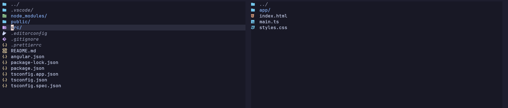

# Project Structure Overview

You generate a new Angular project using the `ng new CoolProjectName` command.
Angular creates something called a 'workspace'.

Here are the  project files the command outputs:

 

## Entry File

Naviagate to the 'src' directory, where you will find the `index.html` file. This file looks like a
regular schmegular html file, but it also contains a funny looking `<app-root></app-root>`
element. It is not a standard HTML element. But it is our first encounter with a bit of Angular
syntax, with the funny looking thing known as a "component selector". 

`<app-root></app-root>` is related to the `App` component defined in the `app.ts` TypeScript class,
with `app-root` defined as this components selector / identifier when used in templates.

When our Angular app is first loaded in the browser, it loads this `index.html` file, which then
uses the `app-root` selector to load the `App` component, effectively instantiating the App.

The UI for the app is defined inside the `app.html` file.

What you get out of the box represents a "fully" functional Angular app, the basic idea to get you
started.

## Run the app

Open a terminal inside the `RoboShop` root directory and run `npm start`. Follow the output
localhost link to open it in the broswer.

## Other Files

`app.ts` - Where the App component is defined. 
`app.config.ts` - App configuration lives here.
`styles.css` - Global styles that apply to your entire application, neat.
`main.ts` - Where your application get's bootstrapped by Angular.

Other fancy ones like the `angular.json`, `tsconfig.json` will be looked at later.
