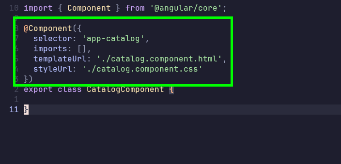

# Creating Standalone Angular Components

In Angular, components not only handle what the user sees, but also what happens when the user
interacts with the UI.

Leverage the Angular CLI to generate all the files needed for a component:

```bash
ng generate component [name]
```

Note on naming conventions:

- catalog.component.ts used to be a strong suggestion in the Angular style guide but has recently
loosened. So it's a choice now. 

To append 'component' to your components name, run this command:

```bash
ng generate component [name] --type=component
```
The command generates the following files:

- catalog.component.css = Styles go here
- catalog.component.html = Your components markup goes here
- catalog.component.spec.ts = Write unit tests for your component in here
- catalog.component.ts = All the logic for your component goes here

## Component class

What is that bit above the class export?



It's called a Decorator.

### Decorators

A decorator is a special TypeScript feature that can be used to attach metadata to a class or other unit of code.

It's basically a function that takes in the class that is being decorated as the 'target', and
modifies it with the specified metadata at runtime.

We do this because Angular, or the browser for that matter, doesn't know what a "Component" is, it
just sees a regular JS Class. So we use this 'Component' decorator to tell Angular to treat this
class as a component, and to define some metadata attributes for this CatalogComponent.

You will notice the 'templateUrl' and 'styleUrl' properties are pointing to the components' html and
css files respectively. It's part of how angular pulls everything together to treat this as a singular
component.

### Styles

Remember that the styles defined in this component are scoped or isolated only to this component. They
do not 'leak' out to the rest of the app. 


