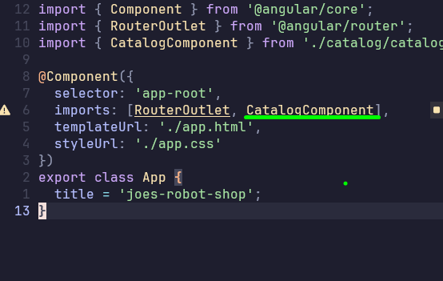

# Use The Component You Created

## Selector property

Inside the @Component decorator defined above the `CatalogComponent` class, a selector property with
the `app-catalog` as the value was defined when angular generated the component files.

Basically, a component selector identifies how to use this component inside another component's
template. You use this selector like you'd use any other HTML element.

Try to use the recently created <app-catalog></app-catalog> component inside `app.html` file.

## Importing components for use in other files

...Angular cried didn't it. It said <app-catalog/> is not a known element? Why? 

In order for us to use it in another component, in this case the app component, we need to import 
the CatalogComponent into the App component.

You do that by providing CatalogComponent in the App components list of imports inside it's
@Component decorator

## Standalone components

Modern Angular uses standalone components, which means that each component must import everything
that it intends to use, such as other components and things like services. This means a component
can standalone as its own cohesive unit, compared to it being managed by a Module (ngModule).

## Selector Prefix

The Ng CLI generated `app-catalog` as a selector when you created the component. The 'app' prefix is
the default selector prefix added to all your components. 

This is to future proof your app against naming colisions with third party libraries or future HTML elements. 

It also makes it easier to identify which components belong to your application.

We have the ability change it to something unique. Open the `angular.json` file and update the
`prefix` property to whatever short prefix name you prefer. This will let angular know to prefix
your selectors with this newly updated prefix string going forward.
