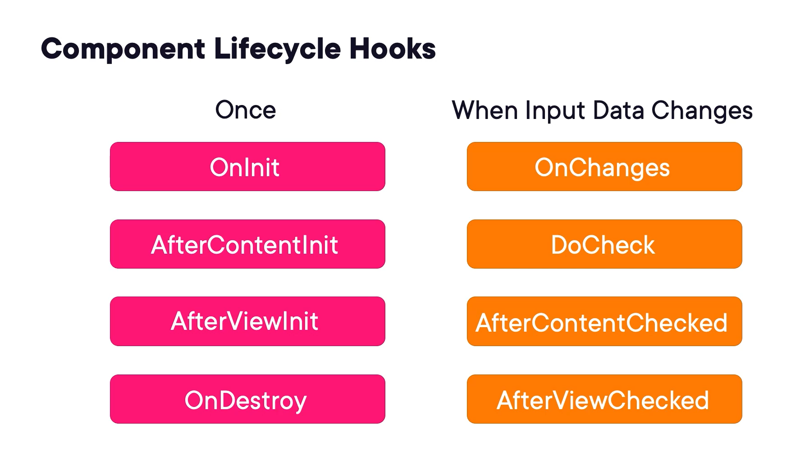
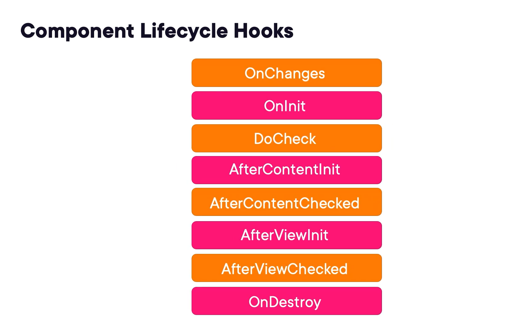

# Component Lifecycle Hooks

Every component in Angular has a lifecycle, and that lifecycle is defined by a series of events
that occur throughout the life of the component. 

In layman's terms, a lifecycle hook is... when the component is loaded, numerous events "occur" in a certain order, so
you can "hook" into these events and write your code to execute when these events happen. 

Some of these lifecycle hooks occur only once, and other occur multiple times as input properties or data changes
throughout the life of the component. So these can be grouped accordingly:



The order they occur in:



Orange = Input Changes

Pink = Occur Once

Most of these lifecycle hooks, however, are not used very commonly at all.

The Angular documentation describes each of them in depth, so dig in there if you'd like to know
more, but just know that the only ones that are commonly used are 
- OnChanges, 
- OnInit, 
- and OnDestroy,
and really OnInit is used much more frequently than OnChanges and OnDestroy.

### OnInit

We typically use OnInit to fetch data for our components.

### OnChanges

It's not uncommon, however, that you'll need to do something programmatically when data for your
component changes, and that's when you use OnChanges.

### OnDestroy

And OnDestroy is generally just used for clean up to avoid memory leaks.

## How to hook into a component's lifecycle events

You hook into a component's lifecycle events in the Components class, and there are three things
that you need to do to implement a lifecycle hook.

1. First, you import the lifecycle event interface,

```typescript
import { Component, OnInit } from '@angular/core';
```

2. And then you implement it on your Component class

```typescript
@Component({
    selector: 'bot-home',
    templateUrl: './home.component.html',
    styleUrls: ['./home.component.css'],
})
export class HomeComponent implements OnInit {
    constructor() {}

    ngOnInit(): void {

    }
}
```

3. Then you create a method on your class for that lifecylce i.e see use of ngOnInit() above

Oh, and notice that the method name is prefixed with `ng` unlike the interface name, so make sure you
remember to add that ng on the front of your lifecycle hook method names

